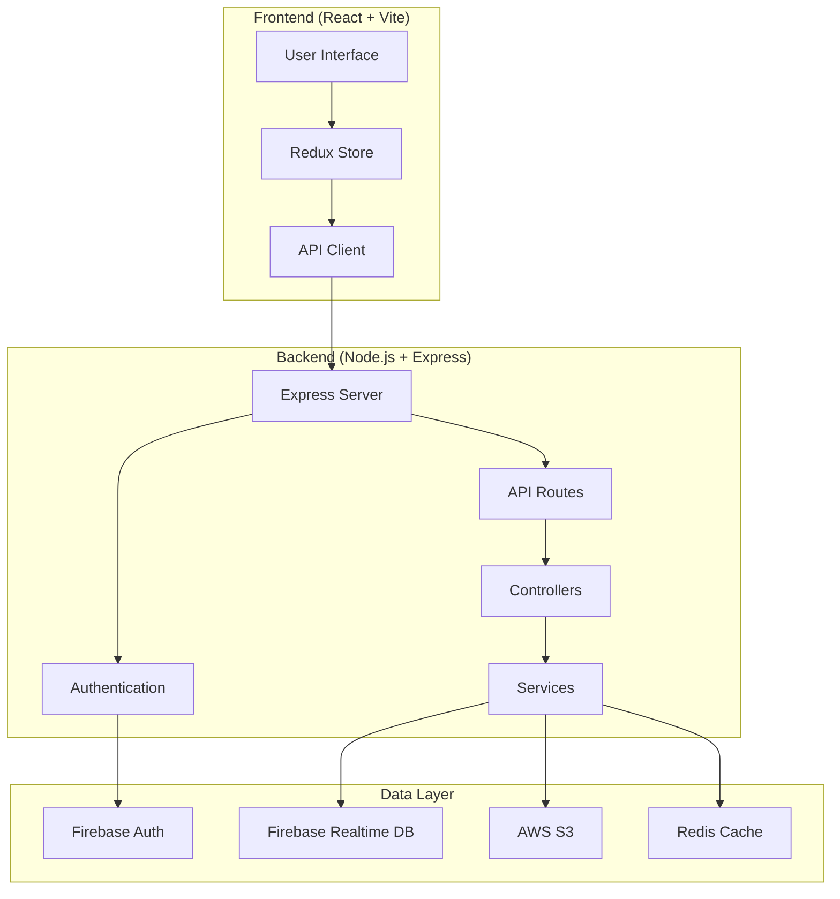

<div align="center">

# 💰 PennyTracker (FinanceTracker)

<p align="center">
  
  
  
  
  
</p>

<p align="center">
  
  
  
</p>

<h3 align="center">🚀 Smart Financial Tracking for the Modern Age</h3>

<p align="center">
  An intelligent finance tracker that automatically monitors your spending habits through message scraping and provides insightful analytics to help you make informed financial decisions.
</p>

<p align="center">
  <a href="#-demo">🌟 Live Demo</a> •
  <a href="#-features">✨ Features</a> •
  <a href="#-quick-start">🚀 Quick Start</a> •
  <a href="#-api-docs">📚 API Docs</a> •
  <a href="#-contributing">🤝 Contributing</a>
</p>

</div>

## 🌟 Demo

Experience PennyTracker in action! Try out our live demo:

<div align="center">

| 🌐 **Live Website** | 📧 **Demo Email** | 🔐 **Password** |
|:---:|:---:|:---:|
| **[PennyTracker.tech](https://www.pennytracker.tech)** | `sridhar@gmail.com` | `sridhar1090` |

</div>

> 💡 **Tip**: Use the demo credentials above to explore all features without setting up your own account.

### 🖥️ Dashboard Preview

<div align="center">
  
</div>

---

## ✨ Features

<div align="center">

| 🤖 **Smart Automation** | 📊 **Advanced Analytics** | 🔒 **Privacy First** |
|:---:|:---:|:---:|
| Automatic message scraping for transaction detection | Visual spending patterns with interactive charts | Enterprise-grade encryption for your data |

| 💸 **Budget Management** | 🚨 **Smart Alerts** | 📱 **Modern UI/UX** |
|:---:|:---:|:---:|
| Set category-wise budgets with limit notifications | Customizable alerts for unusual spending | Responsive design with dark/light themes |

</div>

### 🎯 Core Capabilities

- **🔍 Automatic Message Scraping**: Effortlessly track spending by extracting financial information from messages and transactions
- **💰 Budget Management**: Set budgets for different categories and get notifications when nearing limits  
- **📈 Spending Insights**: Gain overview of spending patterns with visual graphs and analytics
- **⚡ Customizable Alerts**: Receive alerts for unusual spending activity or when bills are due
- **🛡️ Data Privacy**: Your data remains secure and private with advanced encryption methods
- **📊 Export & Reports**: Generate PDF reports and export data in multiple formats
- **🌙 Modern Interface**: Clean, intuitive design with responsive layouts

---

## 🚀 Quick Start

Get PennyTracker running locally in just a few steps!

### 📋 Prerequisites

Before you begin, ensure you have the following installed:

<div align="center">

| Tool | Version | Download |
|:---:|:---:|:---:|
| **Node.js** | v18+ | [Download](https://nodejs.org/) |
| **npm** | v8+ | Included with Node.js |
| **Git** | Latest | [Download](https://git-scm.com/) |

</div>

### ⚡ Installation

1. **Clone the repository**
   ```bash
   git clone https://github.com/Sridhar1030/FinanceTracker.git
   cd FinanceTracker
   ```

2. **Install Backend Dependencies**
   ```bash
   cd BackEnd
   npm install
   ```

3. **Install Frontend Dependencies**
   ```bash
   cd ../FrontEnd  
   npm install
   ```

4. **Environment Setup**
   
   Create `.env` files in both BackEnd and FrontEnd directories:
   
   **BackEnd/.env**
   ```env
   PORT=3000
   FIREBASE_PROJECT_ID=your_project_id
   FIREBASE_PRIVATE_KEY=your_private_key
   FIREBASE_CLIENT_EMAIL=your_client_email
   AWS_ACCESS_KEY_ID=your_aws_access_key
   AWS_SECRET_ACCESS_KEY=your_aws_secret_key
   AWS_REGION=your_aws_region
   AWS_S3_BUCKET=your_s3_bucket
   CORS_ORIGIN=http://localhost:5173
   ```

### 🚦 Running the Application

1. **Start the Backend Server**
   ```bash
   cd BackEnd
   npm run dev
   ```
   > Server will start on http://localhost:3000

2. **Start the Frontend Development Server**
   ```bash
   cd FrontEnd  
   npm run dev
   ```
   > Frontend will start on http://localhost:5173

3. **Access the Application**
   
   Open your browser and navigate to `http://localhost:5173`

### 🏗️ Production Build

For production deployment:

```bash
# Build frontend
cd FrontEnd
npm run build

# Start production server
cd ../BackEnd
npm start
```

---

## 📖 Usage

### 🎯 Getting Started with PennyTracker

1. **🔐 Create an Account**: Sign up and connect your message sources for automatic transaction detection

2. **💰 Set Your Budget**: Define budgets for different categories:
   - 🍕 Food & Dining
   - 🚗 Transportation  
   - 🎬 Entertainment
   - 🛒 Shopping
   - 🏠 Bills & Utilities

3. **📊 Review Your Spending**: 
   - View transaction history with intelligent categorization
   - Analyze spending trends with interactive charts
   - Get insights on your financial habits

4. **💡 Get Insights**: 
   - Receive personalized recommendations
   - Track progress toward financial goals
   - Get alerts for unusual spending patterns

### 🎮 Demo Walkthrough

Try these features using our demo account:

- **Dashboard**: View your financial overview at a glance
- **Transactions**: Browse automatically categorized transactions  
- **Analytics**: Explore spending patterns with charts
- **Budgets**: Set and monitor category-wise spending limits
- **Reports**: Generate and download financial reports

---

## 🛠️ Technology Stack

<div align="center">

### 🎨 Frontend
| Technology | Purpose | Version |
|:---:|:---:|:---:|
| **React** | UI Framework | v18.3.1 |
| **Vite** | Build Tool | v5.4.1 |
| **Tailwind CSS** | Styling | v3.4.13 |
| **Redux Toolkit** | State Management | v2.3.0 |
| **React Router** | Navigation | v6.26.2 |
| **Recharts** | Data Visualization | v2.13.0 |

### 🔧 Backend  
| Technology | Purpose | Version |
|:---:|:---:|:---:|
| **Node.js** | Runtime Environment | v18+ |
| **Express.js** | Web Framework | v4.20.0 |
| **Firebase** | Authentication & Database | v10.14.1 |
| **Redis** | Caching | v4.7.0 |
| **JWT** | Authentication | v9.0.2 |
| **Multer** | File Upload | v1.4.5 |

### ☁️ Cloud Services
| Service | Purpose |
|:---:|:---:|
| **AWS EC2** | Application Hosting |
| **AWS S3** | File Storage (Profile Photos) |
| **Firebase Auth** | User Authentication |
| **Firebase Realtime DB** | Real-time Data Storage |

</div>

---

## 📁 Project Structure

<div align="center">

```
FinanceTracker/
│
├── 🎨 FrontEnd/                 # React Frontend Application
│   ├── 📦 public/               # Static assets
│   ├── 📂 src/
│   │   ├── 🧩 components/       # Reusable UI components
│   │   │   ├── Footer.jsx       # Application footer
│   │   │   ├── SideBar.jsx      # Navigation sidebar
│   │   │   ├── card.jsx         # Card components
│   │   │   └── ...
│   │   ├── 📄 pages/            # Application pages/views
│   │   │   ├── Dashboard.jsx    # Main dashboard
│   │   │   ├── Login.jsx        # Authentication
│   │   │   ├── TransactionTable.jsx # Transaction management
│   │   │   ├── UserPage.jsx     # User profile
│   │   │   └── ...
│   │   ├── 🗃️ store/            # Redux state management
│   │   │   └── expensesSlice.js # Expense state logic
│   │   ├── 🎨 assets/           # Images, icons, etc.
│   │   ├── App.jsx              # Root component
│   │   └── main.jsx             # Application entry point
│   ├── 📋 package.json          # Frontend dependencies
│   └── ⚙️ vite.config.js        # Vite configuration
│
├── 🔧 BackEnd/                  # Node.js Backend Application  
│   ├── 📂 src/
│   │   ├── 🎮 controllers/      # Request handlers
│   │   │   └── auth.controller.js # Authentication logic
│   │   ├── 🛣️ routes/           # API routes
│   │   │   ├── userRoutes.js    # User management
│   │   │   ├── expense.router.js # Expense tracking
│   │   │   └── ...
│   │   ├── 🏗️ models/           # Data models
│   │   │   └── User.model.js    # User data structure
│   │   ├── ⚙️ config/           # Configuration files
│   │   │   └── firebaseConfig.js # Firebase setup
│   │   ├── 🔧 services/         # Business logic
│   │   ├── 🛡️ middlewares/      # Custom middleware
│   │   ├── 📊 db/               # Database utilities
│   │   ├── app.js               # Express app setup
│   │   └── index.js             # Server entry point
│   └── 📋 package.json          # Backend dependencies
│
├── 📚 docs/                     # Documentation (Generated)
├── 📄 README.md                 # Project documentation
└── 📜 LICENSE                   # MIT License
```

</div>

### 🏗️ Architecture Overview

<div align="center">



</div>

---

---

## 📚 API Documentation

### 🔐 Authentication Endpoints

| Method | Endpoint | Description | Body |
|:---:|:---:|:---:|:---:|
| `POST` | `/api/auth/login` | User login with Firebase ID token | `{ idToken: string }` |
| `GET` | `/api/auth/:id` | Get user profile data | - |

### 💰 Expense Management

| Method | Endpoint | Description | Body |
|:---:|:---:|:---:|:---:|
| `GET` | `/api/expense/:userId/summary/:year/:month` | Get monthly expense summary | - |
| `GET` | `/api/expense/:userId/total` | Get total debit/credit amounts | - |
| `GET` | `/api/expense/:userId/monthly/:year/:month` | Get monthly debit/credit | - |
| `GET` | `/api/expense/:userId/daily/:year/:month` | Get daily transactions | - |
| `GET` | `/api/expense/:userId/messages/:year` | Get yearly transaction messages | - |

### 💾 Data Input & Upload

| Method | Endpoint | Description | Body |
|:---:|:---:|:---:|:---:|
| `POST` | `/api/addInput` | Add transaction input | `{ userId, transactionData }` |
| `POST` | `/api/upload` | Upload profile image | `FormData with image file` |

### 💸 Budget Management  

| Method | Endpoint | Description | Body |
|:---:|:---:|:---:|:---:|
| `GET` | `/api/monthly/:userId` | Get user's monthly budget limits | - |
| `POST` | `/api/monthly/:userId` | Set monthly budget limits | `{ limits: object }` |

### 📊 Response Format

All API responses follow this standard format:

```json
{
  "success": true,
  "message": "Operation completed successfully",
  "data": {
    // Response data here
  }
}
```

### 🚨 Error Handling

Error responses include:

```json
{
  "success": false,
  "message": "Error description",
  "error": "Detailed error information"
}
```

**Common HTTP Status Codes:**
- `200` - Success
- `400` - Bad Request
- `401` - Unauthorized  
- `404` - Not Found
- `500` - Internal Server Error

---

## 🚀 Deployment

### 🌐 Production Deployment

The application is deployed on AWS with the following setup:

- **Frontend**: Built with Vite and served via Express static files
- **Backend**: Node.js application running on AWS EC2
- **Database**: Firebase Realtime Database
- **Storage**: AWS S3 for file uploads
- **Domain**: [pennytracker.tech](https://www.pennytracker.tech)

### 🔧 Environment Configuration

**Production Environment Variables:**

```env
NODE_ENV=production
PORT=80
FIREBASE_PROJECT_ID=your_production_project_id
FIREBASE_PRIVATE_KEY=your_production_private_key
FIREBASE_CLIENT_EMAIL=your_production_client_email
AWS_ACCESS_KEY_ID=your_production_aws_key
AWS_SECRET_ACCESS_KEY=your_production_aws_secret
AWS_REGION=your_aws_region
AWS_S3_BUCKET=your_production_bucket
CORS_ORIGIN=https://www.pennytracker.tech
```

---

## 🤝 Contributing

## 🤝 Contributing

We love contributions! Whether you're fixing bugs, adding features, or improving documentation, your help makes PennyTracker better for everyone.

### 🌟 How to Contribute

1. **🍴 Fork the Project**
   ```bash
   # Click the 'Fork' button on GitHub, then clone your fork
   git clone https://github.com/YOUR_USERNAME/FinanceTracker.git
   ```

2. **🌿 Create a Feature Branch**
   ```bash
   git checkout -b feature/AmazingFeature
   ```

3. **✨ Make Your Changes**
   - Write clean, documented code
   - Follow existing code style and conventions
   - Add tests for new functionality

4. **✅ Test Your Changes**
   ```bash
   # Test frontend
   cd FrontEnd && npm run lint
   
   # Test backend  
   cd BackEnd && npm run dev
   ```

5. **💾 Commit Your Changes**
   ```bash
   git commit -m 'Add some AmazingFeature'
   ```

6. **🚀 Push to Your Branch**
   ```bash
   git push origin feature/AmazingFeature
   ```

7. **📝 Open a Pull Request**
   - Go to the original repository on GitHub
   - Click "New Pull Request"
   - Provide a clear description of your changes

### 📋 Development Guidelines

- **Code Style**: Follow the existing code style and use Prettier for formatting
- **Commits**: Use clear, descriptive commit messages
- **Documentation**: Update documentation for any new features
- **Testing**: Ensure your changes don't break existing functionality

### 🐛 Reporting Issues

Found a bug? We'd love to know about it!

1. **Check existing issues** to avoid duplicates
2. **Use the issue templates** provided
3. **Include relevant details**:
   - Operating system and browser
   - Steps to reproduce
   - Expected vs actual behavior
   - Screenshots if applicable

### 💡 Feature Requests

Have an idea for a new feature? 

1. **Open a feature request** issue
2. **Describe the feature** and why it would be useful
3. **Discuss implementation** with maintainers

---

## 📄 License

<div align="center">

This project is licensed under the **MIT License** - see the [LICENSE](LICENSE) file for details.

<p>
  
</p>

**What this means:**
- ✅ Commercial use allowed
- ✅ Modification allowed  
- ✅ Distribution allowed
- ✅ Private use allowed
- ❌ Liability and warranty not provided

</div>

---

## 👥 Team & Support

<div align="center">

### 👨‍💻 Maintainer

**Sridhar**  
[](https://github.com/Sridhar1030)

### 🆘 Support

Need help? We're here for you!

| 📧 **Email** | 🌐 **Website** | 💬 **Issues** |
|:---:|:---:|:---:|
| [Contact Form](https://www.pennytracker.tech/contact) | [PennyTracker.tech](https://www.pennytracker.tech) | [GitHub Issues](https://github.com/Sridhar1030/FinanceTracker/issues) |

</div>

---

<div align="center">

### 🌟 Show Your Support

If PennyTracker helped you manage your finances better, please consider:

[](https://github.com/Sridhar1030/FinanceTracker)
[](https://github.com/Sridhar1030/FinanceTracker/fork)

**Made with ❤️ for better financial management**

</div>
