# 🏗️ System Architecture

Comprehensive overview of PennyTracker's system architecture and design decisions.

## 🎯 Architecture Overview

PennyTracker follows a modern **3-tier architecture** with a React frontend, Node.js backend, and Firebase/AWS cloud services.

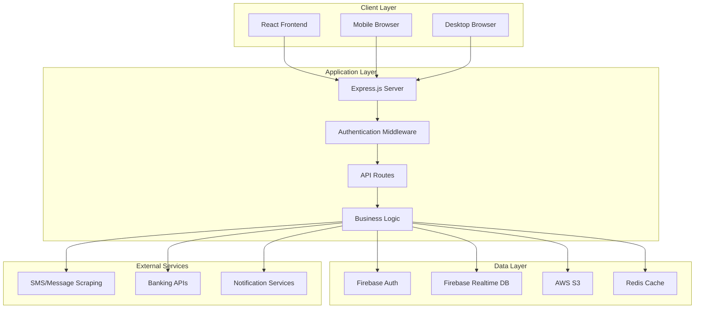

## 🎨 Frontend Architecture

### Component Hierarchy

```
App.jsx
├── Router
│   ├── PublicRoute
│   │   └── Login.jsx
│   └── ProtectedRoute
│       ├── Dashboard.jsx
│       ├── UserPage.jsx
│       ├── TransactionTable.jsx
│       ├── Yearly.jsx
│       ├── AboutUs.jsx
│       └── Help.jsx
├── Shared Components
│   ├── SideBar.jsx
│   ├── Footer.jsx
│   └── card.jsx
└── Redux Store
    ├── expensesSlice.js
    └── store configuration
```

### State Management Flow

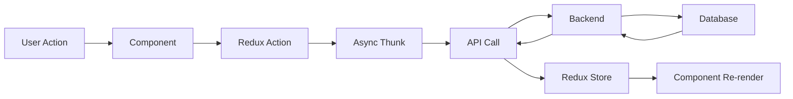

### Technology Stack

| Layer | Technology | Purpose |
|:---:|:---:|:---|
| **Build Tool** | Vite | Fast development builds and HMR |
| **Framework** | React 18 | Component-based UI library |
| **Styling** | Tailwind CSS | Utility-first CSS framework |
| **State Management** | Redux Toolkit | Predictable state container |
| **Routing** | React Router | Client-side navigation |
| **Charts** | Recharts | Data visualization |
| **HTTP Client** | Axios | Promise-based HTTP requests |

## 🔧 Backend Architecture

### Service Layer Pattern

```
Express App
├── Middleware Layer
│   ├── CORS Configuration
│   ├── Authentication
│   └── Error Handling
├── Route Layer
│   ├── Auth Routes
│   ├── Expense Routes
│   ├── User Routes
│   └── Upload Routes
├── Controller Layer
│   ├── Request Validation
│   ├── Business Logic
│   └── Response Formatting
├── Service Layer
│   ├── Database Operations
│   ├── External API Calls
│   └── Business Rules
└── Model Layer
    ├── User Model
    ├── Transaction Model
    └── Budget Model
```

### Request Flow

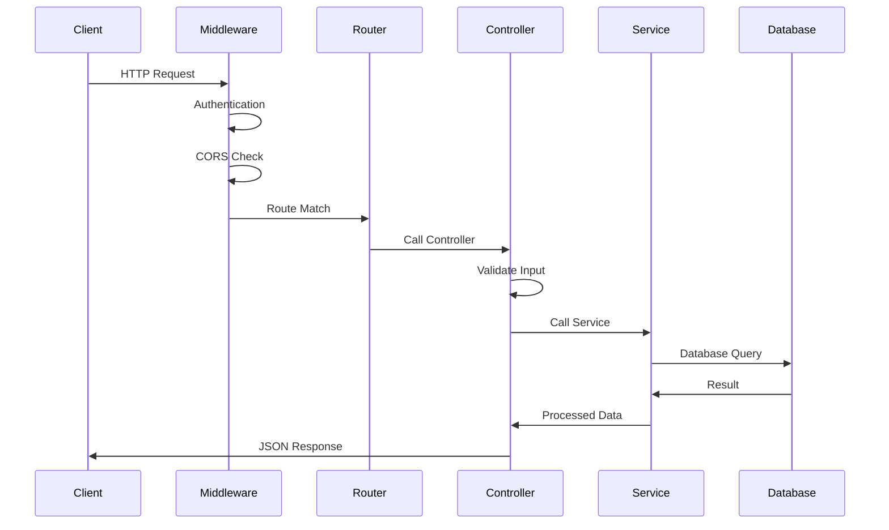

### Technology Stack

| Layer | Technology | Purpose |
|:---:|:---:|:---|
| **Runtime** | Node.js | JavaScript runtime environment |
| **Framework** | Express.js | Web application framework |
| **Authentication** | Firebase Admin | User authentication and authorization |
| **Database** | Firebase Realtime DB | NoSQL real-time database |
| **Cache** | Redis | In-memory data caching |
| **File Storage** | AWS S3 | Object storage for images |
| **Security** | JWT | Token-based authentication |

## 🗄️ Data Architecture

### Database Schema (Firebase Realtime DB)

```json
{
  "user": {
    "$userId": {
      "id": "string",
      "name": "string",
      "email": "string",
      "profession": "string",
      "profile": {
        "profilePicUrl": "string"
      },
      "expenses": {
        "$expenseId": {
          "amount": "number",
          "category": "string",
          "date": "timestamp",
          "description": "string",
          "type": "Debited|Credited"
        }
      },
      "budgets": {
        "monthly": {
          "Food": "number",
          "Transportation": "number",
          "Entertainment": "number"
        }
      },
      "messages": {
        "$messageId": {
          "content": "string",
          "sender": "string",
          "timestamp": "timestamp",
          "parsed": {
            "amount": "number",
            "type": "string",
            "category": "string"
          }
        }
      }
    }
  }
}
```

### Data Flow Patterns

#### 1. Transaction Processing

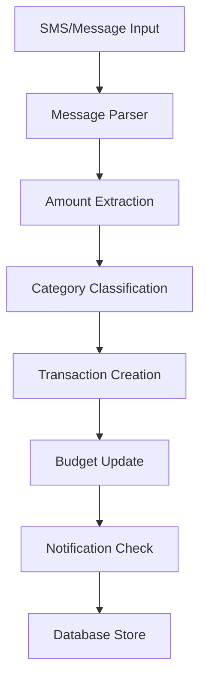

#### 2. Real-time Updates

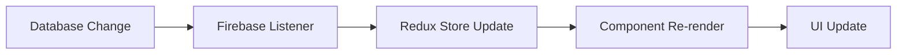

## 🔐 Security Architecture

### Authentication Flow

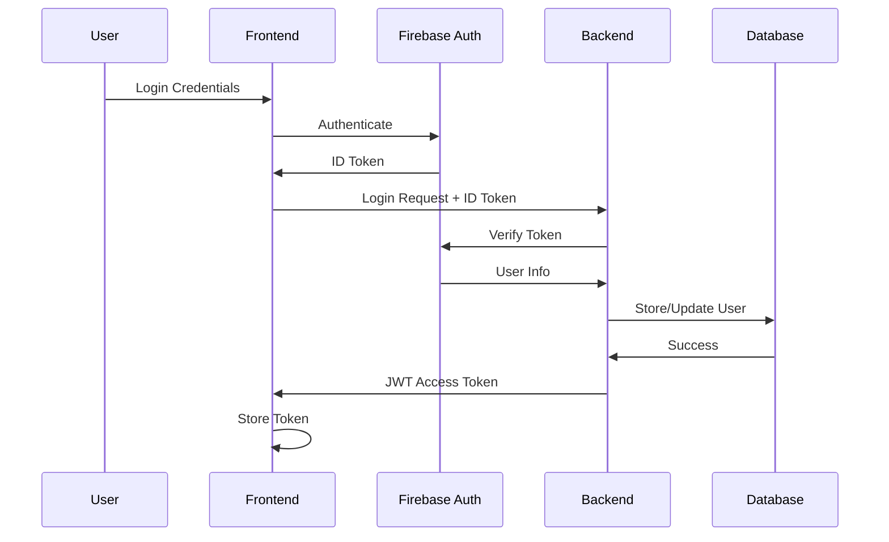

### Security Measures

| Layer | Security Feature | Implementation |
|:---:|:---:|:---|
| **Frontend** | Input Validation | React form validation |
| **Frontend** | XSS Protection | React built-in escaping |
| **Backend** | Authentication | Firebase ID token verification |
| **Backend** | Authorization | JWT token validation |
| **Backend** | CORS Protection | Express CORS middleware |
| **Database** | Access Control | Firebase security rules |
| **Storage** | File Upload Security | Multer with file type validation |
| **Transport** | HTTPS | SSL/TLS encryption |

### Data Encryption

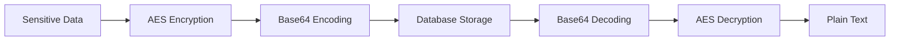

## 🚀 Deployment Architecture

### AWS Deployment

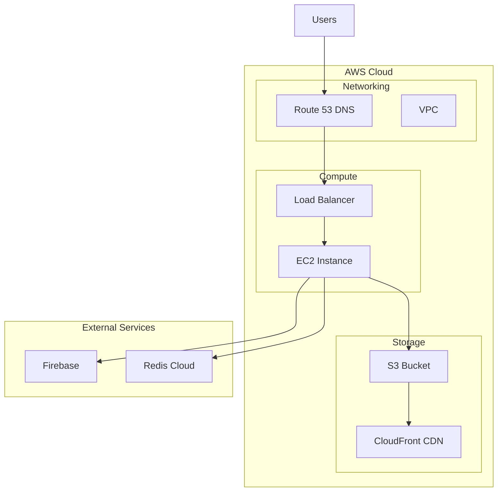

### Scalability Considerations

| Component | Scaling Strategy | Implementation |
|:---:|:---:|:---|
| **Frontend** | CDN Distribution | AWS CloudFront |
| **Backend** | Horizontal Scaling | Multiple EC2 instances + Load Balancer |
| **Database** | Firebase Auto-scaling | Firebase handles scaling automatically |
| **Cache** | Redis Clustering | Redis Cloud cluster mode |
| **Storage** | S3 Auto-scaling | AWS S3 automatic scaling |

## 📊 Performance Architecture

### Optimization Strategies

#### Frontend Optimizations

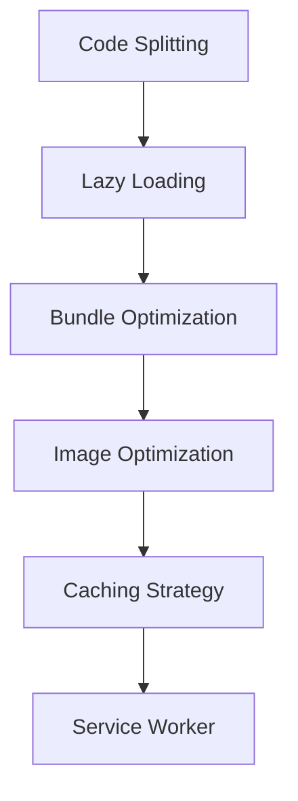

#### Backend Optimizations

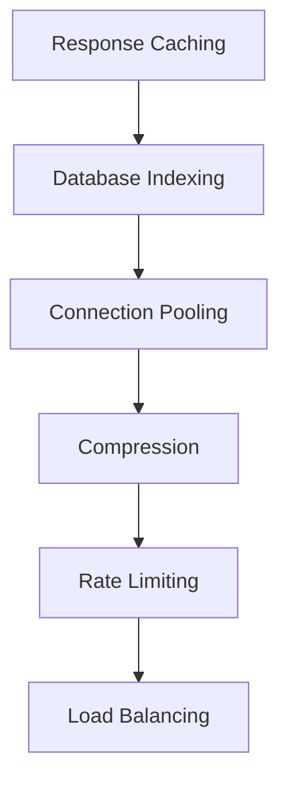

### Monitoring & Observability

| Metric | Tool | Purpose |
|:---:|:---:|:---|
| **Application Performance** | Firebase Performance | Monitor app performance |
| **Error Tracking** | Firebase Crashlytics | Track and report errors |
| **User Analytics** | Firebase Analytics | User behavior insights |
| **Infrastructure** | AWS CloudWatch | Server and resource monitoring |
| **Real User Monitoring** | Web Vitals | Core web vitals tracking |

## 🔄 Integration Patterns

### External Service Integration

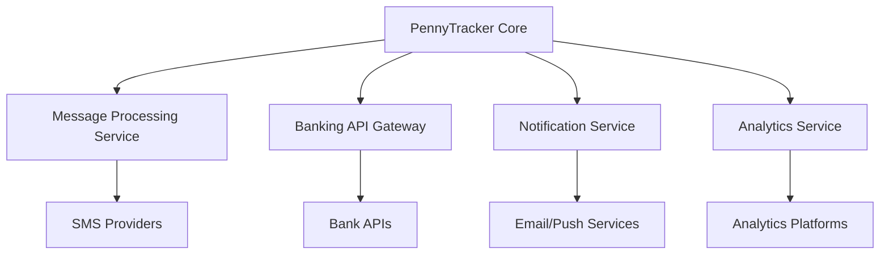

### Event-Driven Architecture

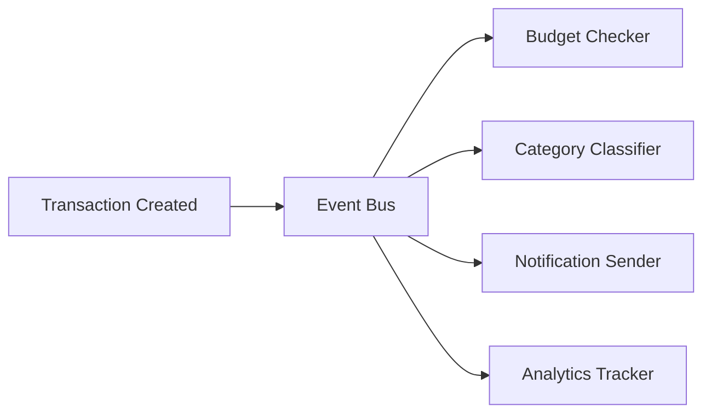

## 📈 Future Architecture Considerations

### Microservices Migration Path

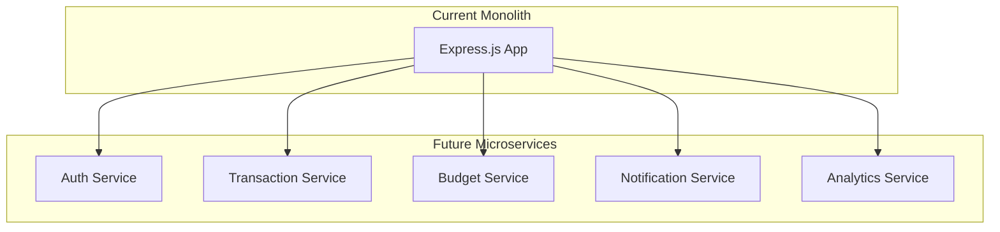

### Technology Evolution

| Current | Future Option | Benefits |
|:---:|:---:|:---|
| **Express.js** | NestJS | Better TypeScript support, modular architecture |
| **Firebase Realtime DB** | PostgreSQL + Prisma | Better data relationships, type safety |
| **Manual Deployment** | Docker + Kubernetes | Container orchestration, auto-scaling |
| **Basic Monitoring** | Comprehensive APM | Better observability and debugging |

---

This architecture is designed to be scalable, maintainable, and secure while providing excellent user experience and developer productivity.